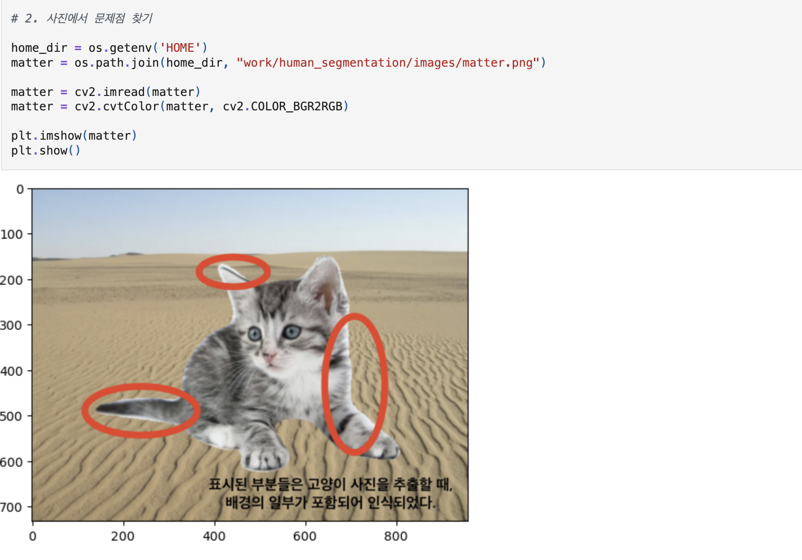
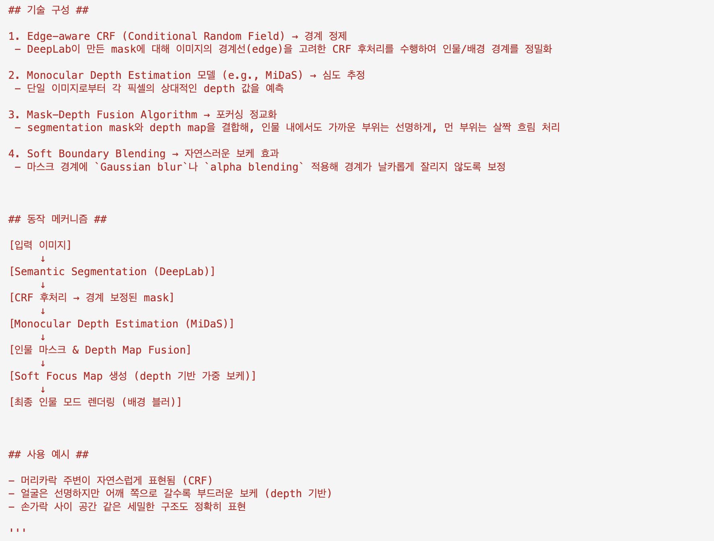
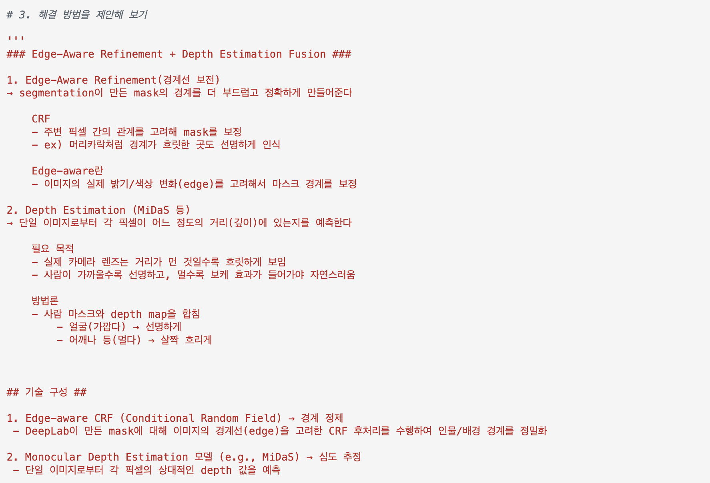

# AIFFEL Campus Online Code Peer Review Templete
- 코더 : 박범찬
- 리뷰어 : 이규철


# PRT(Peer Review Template)
- [X]  **1. 주어진 문제를 해결하는 완성된 코드가 제출되었나요?**
    - 문제에서 요구하는 최종 결과물이 첨부되었는지 확인
        - 중요! 해당 조건을 만족하는 부분을 캡쳐해 근거로 첨부


주어진 문제의 요구 조건인 제대로 된 분할 결과와 배경사진과 합친 이미지가 잘 나와있습니다.
    
- [X]  **2. 전체 코드에서 가장 핵심적이거나 가장 복잡하고 이해하기 어려운 부분에 작성된 
주석 또는 doc string을 보고 해당 코드가 잘 이해되었나요?**
    - 해당 코드 블럭을 왜 핵심적이라고 생각하는지 확인
    - 해당 코드 블럭에 doc string/annotation이 달려 있는지 확인
    - 해당 코드의 기능, 존재 이유, 작동 원리 등을 기술했는지 확인
    - 주석을 보고 코드 이해가 잘 되었는지 확인
        - 중요! 잘 작성되었다고 생각되는 부분을 캡쳐해 근거로 첨부


주어진 문제에서 DeepLab v3 모델을 불러와 이미지를 분할하고 같은 사이즈로 맞춰서 이미지를 합성을 잘 하셨습니다.
        
- [X]  **3. 에러가 난 부분을 디버깅하여 문제를 해결한 기록을 남겼거나
새로운 시도 또는 추가 실험을 수행해봤나요?**
    - 문제 원인 및 해결 과정을 잘 기록하였는지 확인
    - 프로젝트 평가 기준에 더해 추가적으로 수행한 나만의 시도, 
    실험이 기록되어 있는지 확인
        - 중요! 잘 작성되었다고 생각되는 부분을 캡쳐해 근거로 첨부



DeepLab v3 모델의 문제를 해결하기 위한 방법이 자세하게 제시되어있습니다.
        
- [X]  **4. 회고를 잘 작성했나요?**
    - 주어진 문제를 해결하는 완성된 코드 내지 프로젝트 결과물에 대해
    배운점과 아쉬운점, 느낀점 등이 기록되어 있는지 확인
    - 전체 코드 실행 플로우를 그래프로 그려서 이해를 돕고 있는지 확인
        - 중요! 잘 작성되었다고 생각되는 부분을 캡쳐해 근거로 첨부


이 프로젝트를 진행하면서 생겼던 문제와 그 해결방안을 정말 상세하게 잘 적어주셨습니다.
        
- [X]  **5. 코드가 간결하고 효율적인가요?**
    - 파이썬 스타일 가이드 (PEP8) 를 준수하였는지 확인
    - 코드 중복을 최소화하고 범용적으로 사용할 수 있도록 함수화/모듈화했는지 확인
        - 중요! 잘 작성되었다고 생각되는 부분을 캡쳐해 근거로 첨부




코드가 간결하고 효율적이며 보기 좋게 잘 작성되어있었습니다. 문제점 발견과 해결 방안을 정말 잘 정리하셨습니다.

# 회고(참고 링크 및 코드 개선)
```
# 리뷰어의 회고를 작성합니다.
# 코드 리뷰 시 참고한 링크가 있다면 링크와 간략한 설명을 첨부합니다.
# 코드 리뷰를 통해 개선한 코드가 있다면 코드와 간략한 설명을 첨부합니다.

프로젝트를 진행하면서 DeepLab v3 모델을 사용해 이미지를 분할했을때 생기는 경계인식 문제와 과탐 문제에
대한 해결책을 후처리 방식으로 상세하게 알려주셨습니다. 이를 통해서 모델을 바꾸거나 문제에 맞게
파인튜닝 하는 방법 말고도 이미지를 후처리 하는 방식을 통해서 경계 인식 문제와 과탐 문제를 해결할 수 있는
방법을 상세하게 알려주셨습니다. 사진을 보면 그 과정이 정말 자세하게 설명이 되어있어서 좋았습니다.
다음 프로젝트에서는 저도 단순하게 글로 설명하는게 아닌 파이프라인 구조를 제시하면서 더 깔끔하게 리뷰를
정리해보고싶은 생각이 들었습니다. 감사합니다.

```
