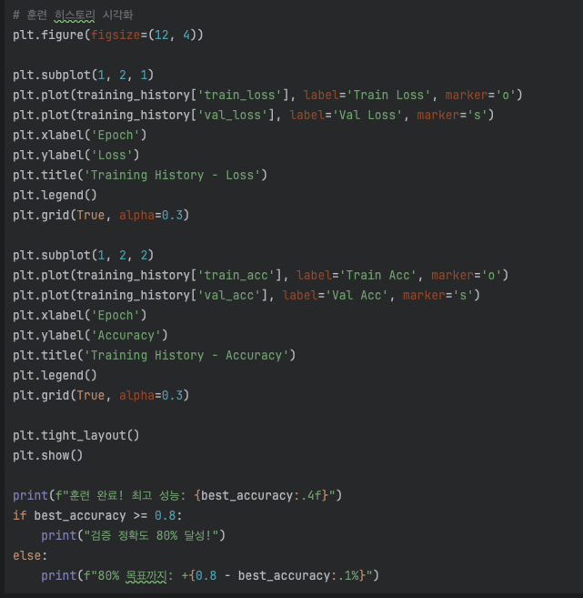
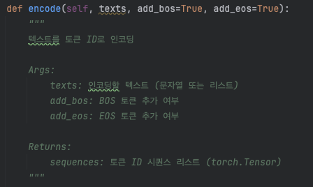
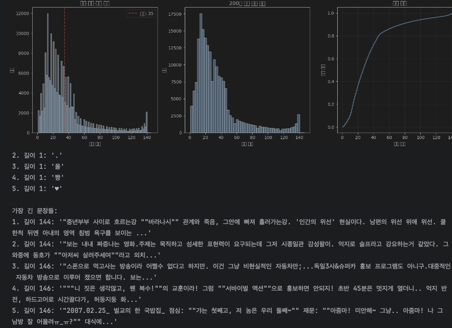
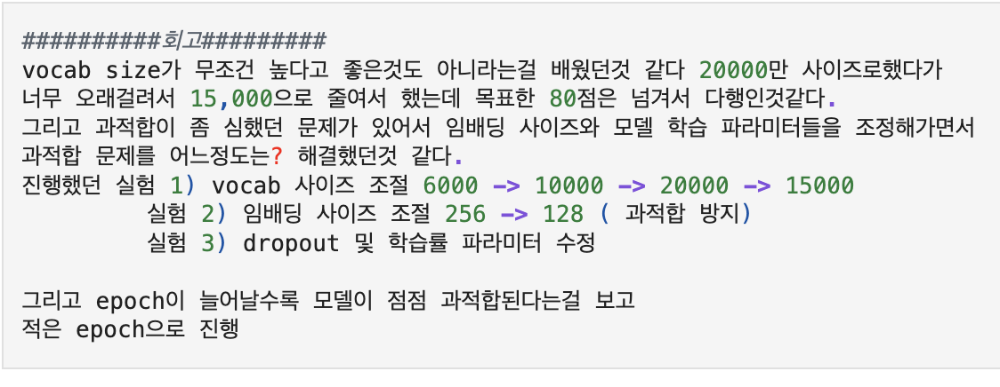
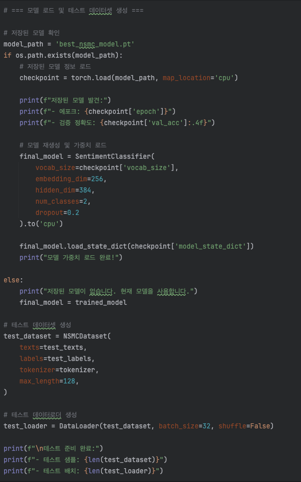

# AIFFEL Campus Online Code Peer Review Templete
- 코더 : 코더의 이름을 작성하세요.
- 리뷰어 : 리뷰어의 이름을 작성하세요.


# PRT(Peer Review Template)
- [X]  **1. 주어진 문제를 해결하는 완성된 코드가 제출되었나요?**
    - 
    
- [X]  **2. 전체 코드에서 가장 핵심적이거나 가장 복잡하고 이해하기 어려운 부분에 작성된 
주석 또는 doc string을 보고 해당 코드가 잘 이해되었나요?**
    - 
    - 함수 생성시 다양한 인자들에 대한 설명을 적어 이해를 도움
        
- [X]  **3. 에러가 난 부분을 디버깅하여 문제를 해결한 기록을 남겼거나
새로운 시도 또는 추가 실험을 수행해봤나요?**
     - 
     - 데이터 길이에 따른 긍정부정의 특성이 어느정도 갈린다는 인사이트를 파악하고
     - 이를 바탕으로 프로젝트를 진행함
        
- [X]  **4. 회고를 잘 작성했나요?**
- - 
    
        
- [X]  **5. 코드가 간결하고 효율적인가요?**
    - - - 
    - 파이썬 스타일 가이드 (PEP8) 를 준수하였는지 확인
    - 코드 중복을 최소화하고 범용적으로 사용할 수 있도록 함수화/모듈화했는지 확인
        - 중요! 잘 작성되었다고 생각되는 부분을 캡쳐해 근거로 첨부


# 회고(참고 링크 및 코드 개선)
```
솔직히 최근 몇번 플젝을하면서 급급하고 어떻게 진행해야하는지 감을 못잡고 있었는데
범찬님들과 다른분들의 진행방법을 지켜보니 어떻게 진행해야할지 조금 감이 잡힌 느낌이다.

다음 노드부터는 같은수준까진 아니여도 반절은 따라갔으면 좋겠다고 생각했다.
```
