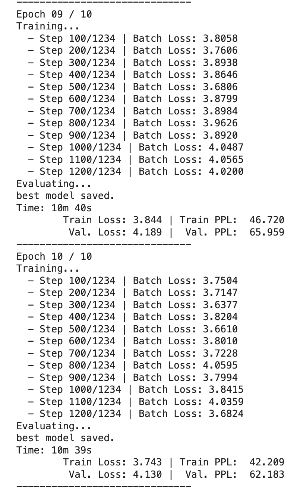
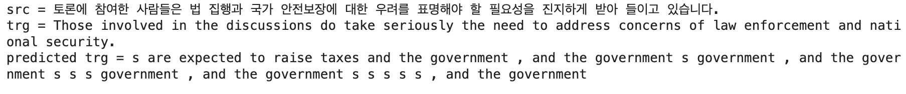
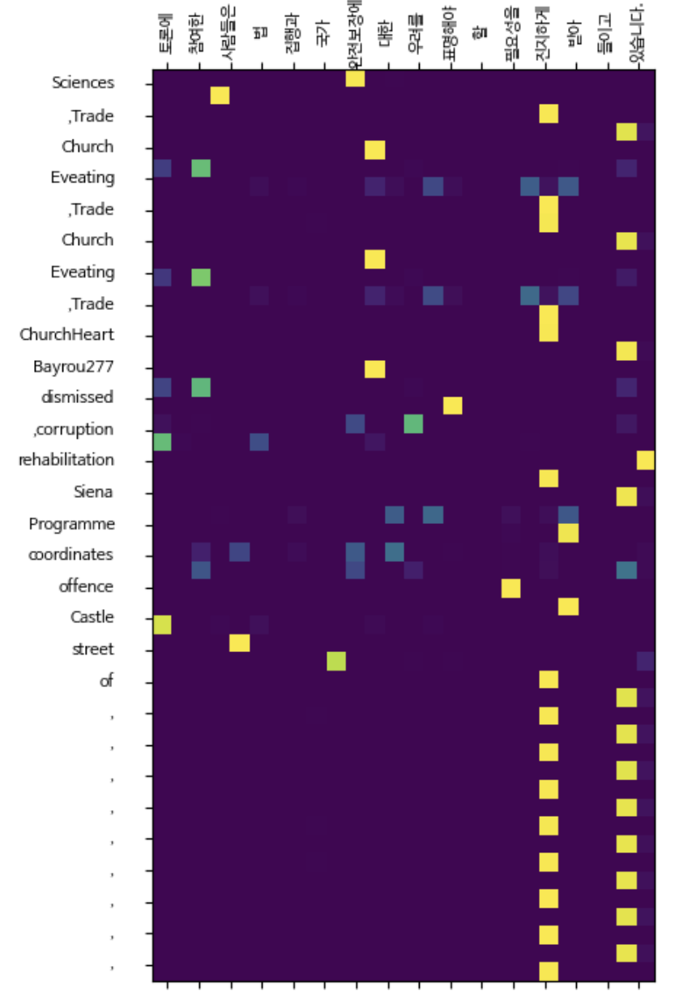
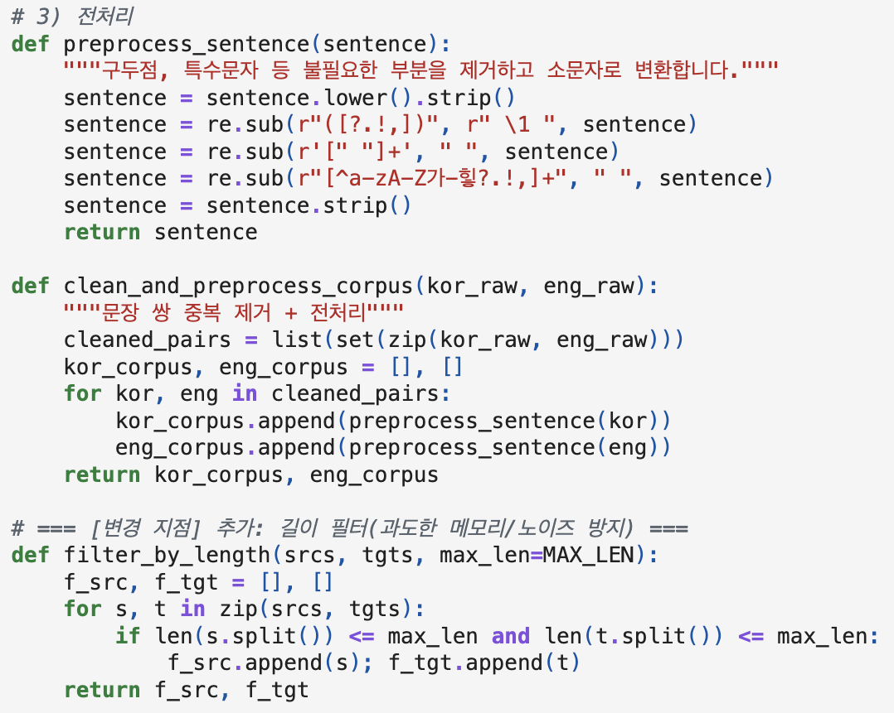
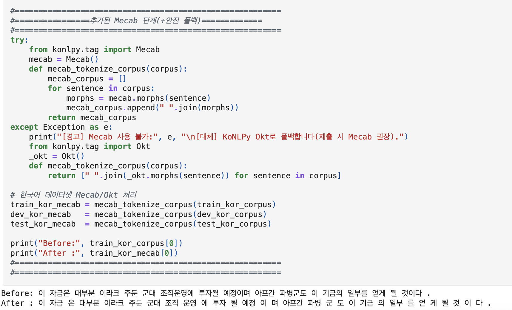
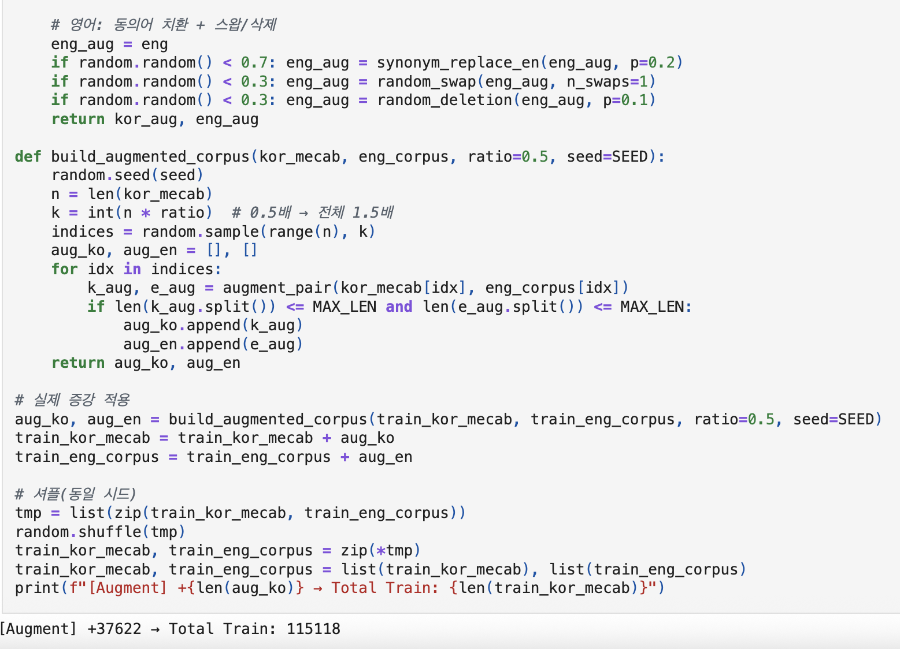
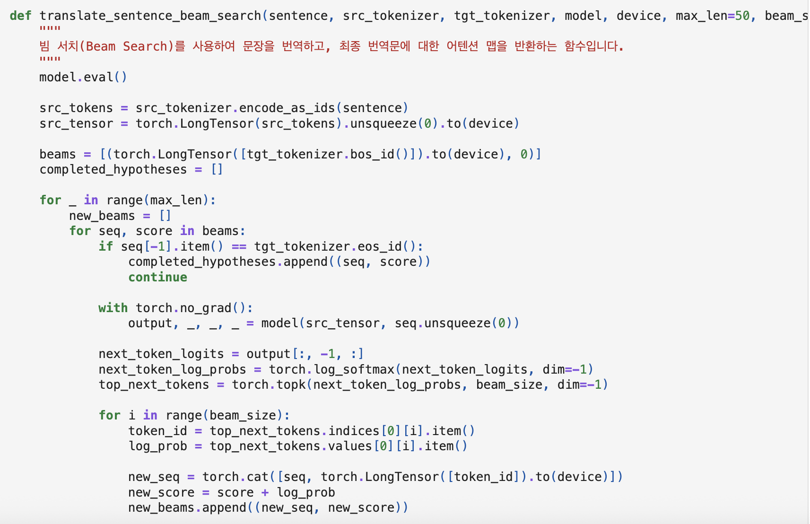
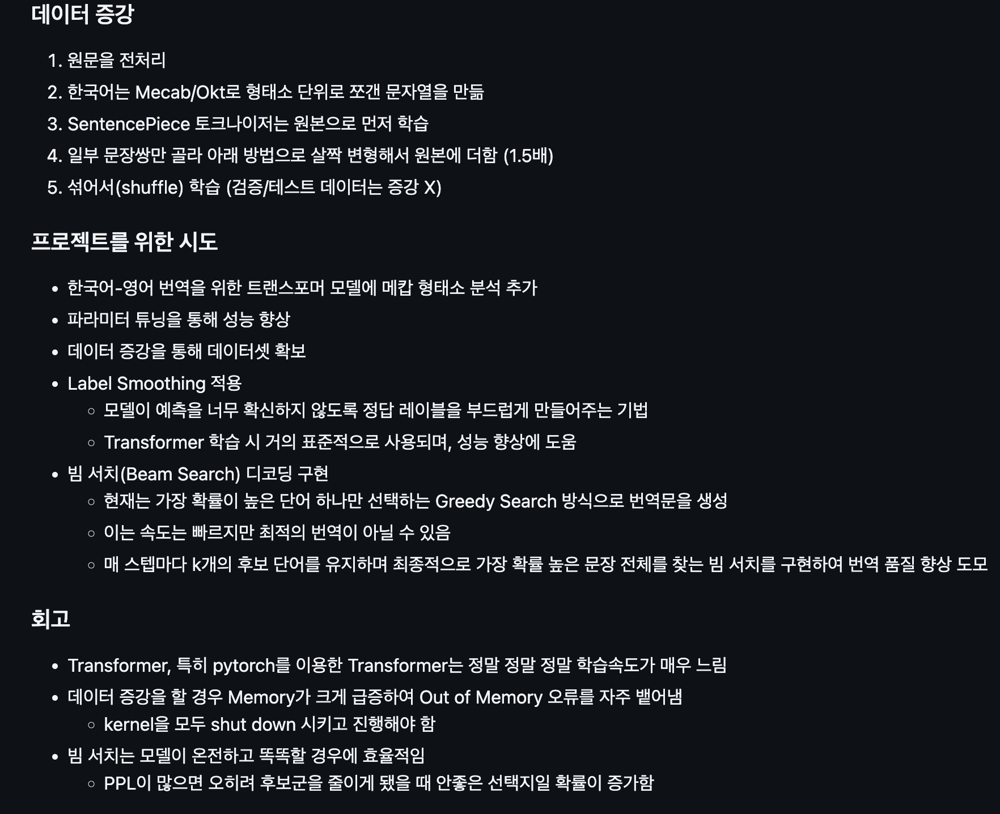

# AIFFEL Campus Online Code Peer Review Templete
- 코더 : 박범찬
- 리뷰어 : 이규철


# PRT(Peer Review Template)
- [X]  **1. 주어진 문제를 해결하는 완성된 코드가 제출되었나요?**
    - 문제에서 요구하는 최종 결과물이 첨부되었는지 확인
        - 중요! 해당 조건을 만족하는 부분을 캡쳐해 근거로 첨부




루브릭에서 요구한 안정적인 학습을 통한 과적합 방지, 번역에 대한 어텐션 맵 시각화 그리고 번역을 평가지표를 통한 평가가 모두 잘 이뤄졌습니다.
    
- [X]  **2. 전체 코드에서 가장 핵심적이거나 가장 복잡하고 이해하기 어려운 부분에 작성된 
주석 또는 doc string을 보고 해당 코드가 잘 이해되었나요?**
    - 해당 코드 블럭을 왜 핵심적이라고 생각하는지 확인
    - 해당 코드 블럭에 doc string/annotation이 달려 있는지 확인
    - 해당 코드의 기능, 존재 이유, 작동 원리 등을 기술했는지 확인
    - 주석을 보고 코드 이해가 잘 되었는지 확인
        - 중요! 잘 작성되었다고 생각되는 부분을 캡쳐해 근거로 첨부




        
텍스트 데이터를 잘 전처리 하셔서 한국어와 영어를 각각 다른 토크나이저를 활용해 토크나이징을 진행하셨습니다. 한국어는 형태소 분석 토크나이저인 Mecab을
활용해 토크나이징을 하셨습니다. 그리고 데이터 증강 부분에서 사전학습된 Word2Vec 모델을 활용해 토큰을 유사도 높은 토큰으로 치환하는 증강 방식과 
역번역 모델을 활용해서 데이터를 증강하신 부분이 매우 감명깊었습니다. 

- [X]  **3. 에러가 난 부분을 디버깅하여 문제를 해결한 기록을 남겼거나
새로운 시도 또는 추가 실험을 수행해봤나요?**
    - 문제 원인 및 해결 과정을 잘 기록하였는지 확인
    - 프로젝트 평가 기준에 더해 추가적으로 수행한 나만의 시도, 
    실험이 기록되어 있는지 확인
        - 중요! 잘 작성되었다고 생각되는 부분을 캡쳐해 근거로 첨부



그리디서치와 빔서치에 대한 회고를 잘 작성하시고 그거에 대해 설명을 해주셨습니다. 뭐가 됐든 모델이 잘 학습된 상태여야 결과가 좋습니다.
        
- [X]  **4. 회고를 잘 작성했나요?**
    - 주어진 문제를 해결하는 완성된 코드 내지 프로젝트 결과물에 대해
    배운점과 아쉬운점, 느낀점 등이 기록되어 있는지 확인
    - 전체 코드 실행 플로우를 그래프로 그려서 이해를 돕고 있는지 확인
        - 중요! 잘 작성되었다고 생각되는 부분을 캡쳐해 근거로 첨부



팀 프로젝트 단위로 회고를 잘 작성하셨습니다.
        
- [X]  **5. 코드가 간결하고 효율적인가요?**
    - 파이썬 스타일 가이드 (PEP8) 를 준수하였는지 확인
    - 코드 중복을 최소화하고 범용적으로 사용할 수 있도록 함수화/모듈화했는지 확인
        - 중요! 잘 작성되었다고 생각되는 부분을 캡쳐해 근거로 첨부

코드가 잘 작성되었습니다.

# 회고(참고 링크 및 코드 개선)
```
# 리뷰어의 회고를 작성합니다.
# 코드 리뷰 시 참고한 링크가 있다면 링크와 간략한 설명을 첨부합니다.
# 코드 리뷰를 통해 개선한 코드가 있다면 코드와 간략한 설명을 첨부합니다.

범찬님 팀 프로젝트는 매우 인상깊었습니다. 팀 단위의 프로젝트를 수행하셨고 특히 역번역 모델을 활용한 데이터 증강 부분이 매우 인상깊었습니다.
저의 회고는 저희 팀은 소통은 많이 했지만 팀 단위로 움직인게 아닌 개개인이 프로젝트를 진행해서 그 부분이 매우 아쉬웠습니다. 다음 노드에서는
팀 단위로 각자 역할을 범찬님 팀 처럼 분배해서 진행을 하는게 더 효율적이고 효과적이라고 생각을 했습니다. 팀 프로젝트 경험이 매우 중요하게 
느껴졌습니다.
```
